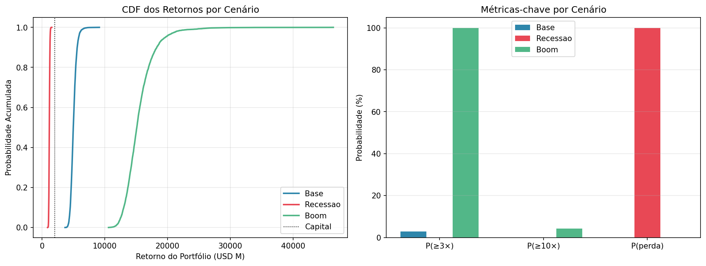
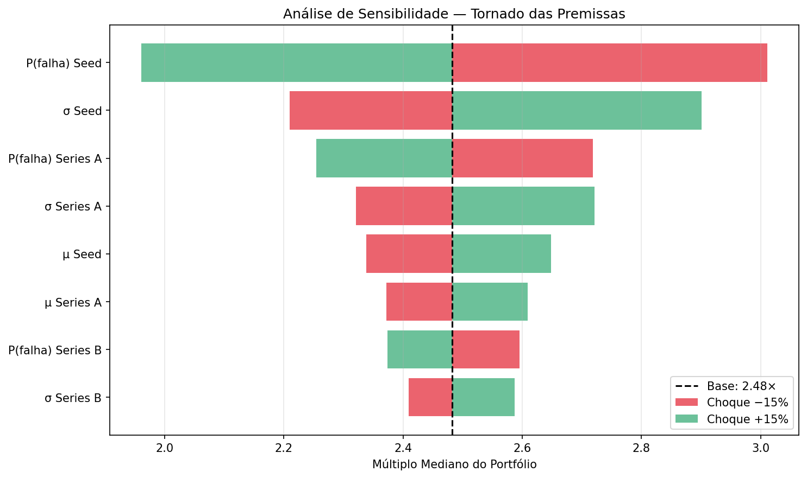

# Tearsheet Executivo — Portfólio VC

## Recomendação ao Comitê de Investimento: ❌ **REJEITAR**

**Justificativa:**

- Risco de perda em recessão = 100.0% (limite IC: 40%)

---

## 1. Cenário Base — Premissas Históricas

- **Capital investido:** USD 1996.0 M
- **Startups no portfólio:** 1996
- **Iterações Monte Carlo:** 5,000

| Métrica | Valor |
|---|---|
| Valor esperado | USD 5016.1 M |
| Mediana | USD 4967.7 M |
| Múltiplo mediano | 2.49× |
| VaR 5% (pessimista) | USD 4338.7 M |
| VaR 95% (otimista) | USD 5825.0 M |
| P(retorno ≥ 3×) | 2.9% |
| P(retorno ≥ 10×) | 0.0% |

## 2. Stress-Test Macro

Choque comparativo entre Base, Recessão (2008-like) e Boom (2021-like).

| Cenário | Mediana (M USD) | Múltiplo | P(3×) | P(perda) |
|---|---|---|---|---|
| Base | 4967.7 | 2.49× | 2.9% | 0.0% |
| Recessao | 1151.5 | 0.58× | 0.0% | 100.0% |
| Boom | 15101.0 | 7.57× | 100.0% | 0.0% |

## 3. Alocação Ótima por Estágio

Grid search maximizando **Sortino Ratio** (downside-only).

**Top alocação:**

- Seed: **0%**
- Series A: **20%**
- Series B: **80%**
- Series C: **0%**

Sortino = **10.593** · P(3×) = 22.9% · P(perda) = 2.1%

## 4. Sensibilidade às Premissas

Tornado chart: variação ±15% ceteris paribus em cada premissa.

**Top 3 premissas mais sensíveis:**

- **P(falha) Seed** — amplitude 1.05× (de 3.01× a 1.96×)
- **σ Seed** — amplitude 0.69× (de 2.21× a 2.90×)
- **P(falha) Series A** — amplitude 0.46× (de 2.72× a 2.25×)

---

## Metodologia

- **Mortalidade:** Binomial(1, p_falha) calibrada por estágio (literatura VC).
- **Multiplicador de retorno:** LogNormal(μ, σ) — captura *power law* característica.
- **Imputação de valuations faltantes:** Ridge Regression segmentada por setor (K-Fold CV).
- **Decisão:** heurística calibrada por benchmarks Cambridge Associates (mediana global VC ≈ 2.0× TVPI).
